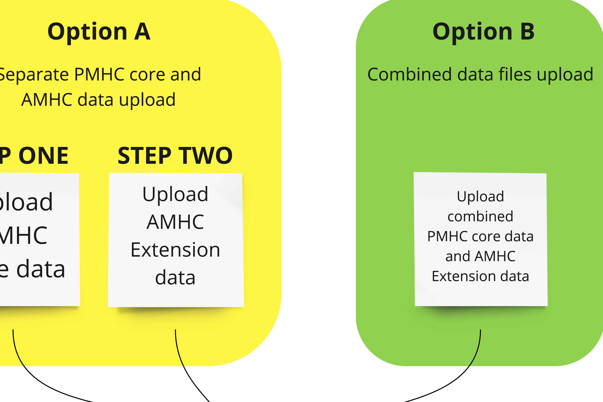

.. _upload_specification:

Upload specification
====================

File types
^^^^^^^^^^

Files will be accepted in the following types:

- Comma Separated Values (CSV)
- Excel (XLSX)

Comma Separated Values (CSV)
~~~~~~~~~~~~~~~~~~~~~~~~~~~~

Requirements for CSV files:

- The CSV files must conform to `RFC 4180 <https://www.ietf.org/rfc/rfc4180.txt>`__.
- In addition, CSV files must be created using UTF-8 character encoding.
- CSV files must have the file extension .csv
- Multiple CSV files must be uploaded - one CSV file for each format described :ref:`below <amhc-files-to-upload>`.
- The CSV files must be compressed into a single file by zipping before upload.
  The filename of the zip file doesn't matter as long as it has the file extension .zip

Excel (XLSX)
~~~~~~~~~~~~

Requirements for XLSX files:

Excel files must be in XLSX format. The following versions of Excel support this format:

  - Excel 2007 (v12.0)
  - Excel 2010 (v14.0)
  - Excel 2013 (v15.0)
  - Excel 2016 (v16.0)

One XLSX file must be uploaded containing multiple worksheets - one worksheet
for each format described :ref:`below <amhc-files-to-upload>`.

When saving your file, please choose the filetype 'Excel Workbook (.xlsx)'.

The filename of the Excel file doesn't matter as long as it has the file extension .xlsx

.. _amhc-base-version:

AMHC Base Version
^^^^^^^^^^^^^^^^^

The AMHC upload format is slightly different to the
`PMHC MDS Version 2.0 upload format <https://docs.pmhc-mds.com/projects/data-specification/en/v2/upload-specification.html#file-format>`_.

The AMHC upload format separates collection occasion data into a separate
Collection Occasions worksheet so that multiple measures can be collected
at a single collection occasion.

The AMHC upload format aligns with a future PMHC MDS Version 3.0 file format. No
date has been set for the release of the PMHC MDS Version 3.0 upload file format.

In addition to the collection occasion/measure changes, the AMHC upload format
adds additional values to support the AMHC extension.

.. _how-to-upload-amhc-files:

How to upload AMHC Files
^^^^^^^^^^^^^^^^^^^^^^^^

AMHC files/worksheets can be uploaded to the PMHC MDS in one of two ways:

* :ref:`Option A: Separate PMHC and AMHC uploads <upload-option-A>` - Option A is
  recommended for organisations who have not yet changed their standard upload
  files to include AMHC data. It allows these organisations to
  do their normal PMHC MDS upload and then do a second upload for AMHC data.
  Option A is also recommended for organisations who use Data Entry instead of
  upload for the PMHC MDS data, but who wish to upload AMHC data.

* :ref:`Option B: One upload including PMHC and AMHC clients <upload-option-B>` -
  Option B is recommended for organisations who have already migrated their
  standard PMHC MDS uploads to allow AMHC uploads at the same time. It allows
  both PMHC MDS and AMHC data to be uploaded together in one upload.

.. _data-model-upload-diagram:

.. _upload-option-A:

Option A: Separate PMHC and AMHC uploads
~~~~~~~~~~~~~~~~~~~~~~~~~~~~~~~~~~~~~~~~

When uploading standard PMHC clients and AMHC clients separately, the upload
for the standard PMHC clients will continue to use the
`PMHC MDS Version 2.0 upload format <https://docs.pmhc-mds.com/projects/data-specification/en/v2/upload-specification.html#file-format>`_
and the upload for the AMHC clients must use the format as described in this document.

.. _upload-option-B:

Option B: One upload including PMHC and AMHC clients
~~~~~~~~~~~~~~~~~~~~~~~~~~~~~~~~~~~~~~~~~~~~~~~~~~~~

For those organisations who are ready to change their
standard PMHC MDS uploads, PMHC MDS and AMHC uploads can be combined together
in the one upload to the PMHC MDS.

.. _amhc-files-to-upload:

Files or worksheets to upload
^^^^^^^^^^^^^^^^^^^^^^^^^^^^^

The AMHC extension is used in two contexts:

1. The AMHC Intake team provide data to the PMHC MDS about clients that
   they have helped through the intake phone number.
2. The AMHC Hubs provide data to the PMHC MDS about clients who have
   been referred to them by the Intake teams.

Which files/worksheets need to be uploaded to the PMHC MDS depends on the
context for which the data is being provided.

.. _files-intake-context:

Files/worksheets for the Intake context
~~~~~~~~~~~~~~~~~~~~~~~~~~~~~~~~~~~~~~~

When uploading AMHC data files for the Intake context only the
following files/worksheets need to be uploaded to the PMHC MDS:

.. csv-table:: Summary of Intake files to upload
  :file: upload-file-types-amhc-intake.csv
  :header-rows: 1

.. _files-hub-context:

Files/worksheets for the Hub context
~~~~~~~~~~~~~~~~~~~~~~~~~~~~~~~~~~~~

When uploading AMHC data files for the Hub context only the
following files/worksheets need to be uploaded to the PMHC MDS:

.. csv-table:: Summary of Hub files to upload
  :file: upload-file-types-amhcp-hub.csv
  :header-rows: 1

All files must be internally consistent. An example of what this means
is that for every AMHC episode, service contact and measures in an upload file,
there must be a corresponding episode in the episodes file/worksheet.
It also means that or every row in the episodes file/worksheet, there must be a
corresponding client in the clients file/worksheet.

.. _amhc-file-format:

File format
^^^^^^^^^^^

Requirements for file formats:

- The first row must contain the column headings as defined for each file type.
- Each item is a column in the file/worksheet. The 'Field Name' must be used for
  the column headings. The columns must be kept in the same order.
- The second and subsequent rows must contain the data.
- Data elements for each file/worksheet are defined at :ref:`record-formats`.
- For data elements that allow multiple values, each value should be separated by a space; for example: `1 3 6`.

All AMHC data uploads must include a Metadata file/worksheet. See :ref:`metadata-format`.

Each of the below example files assumes the following organisation structure:

+------------------+-----------------------------+--------------------------------------------+---------------------+-------------------+
| Organisation Key | Organisation Name          | Organisation Type                           | Parent Organisation | Organisation Path |
+==================+=============================+============================================+=====================+===================+
| PHN999           | Example PHN                 | Primary Health Network                     | None                | PHN999            |
+------------------+-----------------------------+--------------------------------------------+---------------------+-------------------+
| Intake01         | Example Intake Organisation | Other                                      | PHN999              | PHN999:Intake01   |
+------------------+-----------------------------+--------------------------------------------+---------------------+-------------------+
| Hub01            | Example Hub Organisation    |State/Territory Health Service Organisation | PHN999              | PHN999:Hub01      |
+------------------+-----------------------------+--------------------------------------------+---------------------+-------------------+

.. _metadata-format:

Metadata file
~~~~~~~~~~~~~

All AMHC data uploads in both Intake and Hub contexts must include a Metadata file/worksheet.
- In the first row, the first cell must contain 'key' and the second cell must contain 'value'
- In the second row, the first cell must contain 'type' and the second cell must contain 'AMHC'
- In the third row, the first cell must contain 'version' and the second cell must contain '3.0'

i.e.:

+--------------+------------+
| key          | value      |
+--------------+------------+
| type         | AMHC       |
+--------------+------------+
| version      | 3.0        |
+--------------+------------+

Data elements for the AMHC metadata upload file/worksheet are defined at
:ref:`metadata-data-elements`.

Example AMHC metadata data:

.. This is a comment. AMHC metadata validation rules required!

- `CSV AMHC metadata file <../_static/intake/metadata.csv>`_.
- `XLSX AMHC metadata worksheet <../_static/intake/AMHC-3-0-metadata.xlsx>`_.

.. _organisation-format:

Organisation file format
~~~~~~~~~~~~~~~~~~~~~~~~

This file is for PHN use only. The organisation file/worksheet is optional.
This is similar to the standard
`PMHC MDS Provider Organisation file/worksheet <https://docs.pmhc-mds.com/data-specification/upload-specification.html#organisation-format>`_.

Data elements for the Provider Organisation upload file/worksheet are defined
at `Provider Organisation data elements <https://docs.pmhc-mds.com/data-specification/data-model-and-specifications.html#provider-organisation-data-elements>`_.

Example organisation data:

- `CSV organisation file <../_static/intake/organisations.csv>`_.
- `XLSX organisation worksheet <../_static/intake/AMHC-3-0-organisations.xlsx>`_.

.. _client-format:

Client file format
~~~~~~~~~~~~~~~~~~

The client file/worksheet is required to be uploaded each time.

Data elements for the client upload file/worksheet are defined at `Client data elements <https://docs.pmhc-mds.com/data-specification/data-model-and-specifications.html#client-data-elements>`_.

Example intake client data:

- `CSV Intake client file <../_static/intake/clients.csv>`_.
- `XLSX Intake client worksheet <../_static/intake/AMHC-3-0-clients.xlsx>`_.

Example hub client data:

- `CSV Hub client file <../_static/hub/clients.csv>`_.
- `XLSX Hub client worksheet <../_static/hub/AMHC-3-0-clients.xlsx>`_.

.. _episode-format:

Episode file format
~~~~~~~~~~~~~~~~~~~

The episode file/worksheet is required to be uploaded each time.

Data elements for the episode upload file/worksheet are defined
at `Episode data elements <https://docs.pmhc-mds.com/data-specification/data-model-and-specifications.html#episode-data-elements>`_.

Example intake episode data:

- `CSV Intake episode file <../_static/intake/episodes.csv>`_.
- `XLSX Intake episode worksheet <../_static/intake/AMHC-3-0-episodes.xlsx>`_.

Example hub episode data:

- `CSV Hub episode file <../_static/hub/episodes.csv>`_.
- `XLSX Hub episode worksheet <../_static/hub/AMHC-3-0-episodes.xlsx>`_.

.. _amhc-episode-format:

AMHC Episode file format
~~~~~~~~~~~~~~~~~~~~~~~~

The AMHC episode file/worksheet is required to be uploaded each time.

Data elements for the AMHC Episode upload file/worksheet are defined at
:ref:`amhc-episode-data-elements`.

Example AMHC episode data:

- `CSV Hub AMHC episode file <../_static/hub/amhc-episodes.csv>`_.
- `XLSX Hub AMHC episode worksheet <../_static/hub/AMHC-3-0-amhc-episodes.xlsx>`_.

.. _collection-occasion-format:

Collection Occasion file format
~~~~~~~~~~~~~~~~~~~~~~~~~~~~~~~

The Collection Occasion file/worksheet is required to be uploaded each time.

Data elements for the Collection Occasion upload file/worksheet are defined at
:ref:`collection-occasion-data-elements`.

Example Hub Collection Occasion data:

- `CSV Hub Collection Occasion file <../_static/hub/collection-occasions.csv>`_.
- `XLSX Hub Collection Occasion worksheet <../_static/hub/AMHC-3-0-collection-occasions.xlsx>`_.

.. _k10p-format:

K10+ file format
~~~~~~~~~~~~~~~~

The K10+ file/worksheet is required to be uploaded each time.

Data elements for the K10+ upload file/worksheet are defined
at :ref:`k10p-data-elements`.

Example Hub K10+ data:

- `CSV Hub K10+ file <../_static/hub/k10p.csv>`_.
- `XLSX Hub K10+ worksheet <../_static/hub/AMHC-3-0-k10p.xlsx>`_.

.. _k5-format:

K5 file format
~~~~~~~~~~~~~~

The K5 file/worksheet is required to be uploaded each time.

Data elements for the K5 upload file/worksheet are defined
at :ref:`k5-data-elements`.

Example Hub K5 data:

- `CSV Hub K5 file <../_static/hub/k5.csv>`_.
- `XLSX Hub K5 worksheet <../_static/hub/AMHC-3-0-k5.xlsx>`_.

.. _sdq-format:

SDQ file format
~~~~~~~~~~~~~~~

The SDQ file/worksheet is required to be uploaded each time.

Data elements for the SDQ upload file/worksheet are defined
at :ref:`sdq-data-elements`.

Example Hub SDQ data:

- `CSV Hub SDQ file <../_static/hub/sdq.csv>`_.
- `XLSX Hub SDQ worksheet <../_static/hub/AMHC-3-0-sdq.xlsx>`_.

.. _iar-dst-format:

IAR-DST file format
~~~~~~~~~~~~~~~~~~~

The IAR-DST file/worksheet is required to be uploaded each time.

Data elements for the IAR-DST upload file/worksheet are defined
at :ref:`iar-dst-data-elements`.

Example Intake IAR-DST data:

- `CSV Intake IAR-DST file <../_static/intake/iar-dst.csv>`_.
- `XLSX Intake IAR-DST worksheet <../_static/intake/AMHC-3-0-iar-dst.xlsx>`_.

.. _service-contact-format:

Service Contact file format
~~~~~~~~~~~~~~~~~~~~~~~~~~~

The service contact file/worksheet is required to be uploaded each time.

Data elements for the service contact upload file/worksheet are defined
at :ref:`service-contact-data-elements`.

Example Hub service contact data:

- `CSV Hub service contact file <../_static/hub/service-contacts.csv>`_.
- `XLSX Hub service contact worksheet <../_static/hub/AMHC-3-0-service-contacts.xlsx>`_.

.. _amhc-service-contact-format:

AMHC Service Contact file format
~~~~~~~~~~~~~~~~~~~~~~~~~~~~~~~~

The AMHC service contact file/worksheet is required to be uploaded each time.

Data elements for the AMHC Service Contact upload file/worksheet are defined at
:ref:`amhc-service-contact-data-elements`.

Example Hub AMHC service contact data:

- `CSV Hub AMHC service contact file <../_static/hub/amhc-service-contacts.csv>`_.
- `XLSX Hub AMHC service contact worksheet <../_static/hub/AMHC-3-0-amhc-service-contacts.xlsx>`_.

.. _practitioner-format:

Practitioner file format
~~~~~~~~~~~~~~~~~~~~~~~~

The Practitioner file/worksheet is required for the first hub upload and when practitioner
information changes. It is optional otherwise. It can be left out of an Intake upload.

Data elements for the Practitioner upload file/worksheet are defined
at `Practitioner data elements <https://docs.pmhc-mds.com/data-specification/data-model-and-specifications.html#practitioner-data-elements>`_.

Example Intake Practitioner data:

Practitioner data is not required in an Intake upload file.

Example Hub Practitioner data:

- `CSV Hub practitioner file <../_static/hub/practitioners.csv>`_.
- `XLSX Hub practitioner worksheet <../_static/hub/AMHC-3-0-practitioners.xlsx>`_.

.. _deleting-records:

Deleting records
~~~~~~~~~~~~~~~~

* Records of the following type can be deleted via upload:

  * Client
  * Intake
  * Intake Collection Occasion
  * Episode
  * AMHC Episode
  * Collection Occasion
  * K10+
  * K5
  * SDQ
  * IAR-DST
  * Service Contact
  * AMHC Service Contact
  * Practitioner

* An extra optional "delete" column can be added to each of the supported
  upload files/worksheets.

* If included, this column must be the third column in each file, after the organisation
  path and the record's entity key.

* To delete a record, include its organisation path and its entity key, leave
  all other fields blank and put "delete" in the "delete" column. Please note
  that case is important. "DELETE" will not be accepted.

* Marking a record as deleted will require all child records of that record also
  to be marked for deletion. For example, marking a client as deleted will
  require all episodes, service contacts and collection occasions of that
  client to be marked for deletion.

* While deletions can be included in the same upload as insertions/updates,
  we recommend that you include all deletions in a separate upload that is
  uploaded before the insertions/updates.

Example AMHC files showing how to delete via upload:

AMHC Episode data
#################

- `CSV delete metadata file <../_static/delete/metadata.csv>`_.
- `CSV delete client file <../_static/delete/clients.csv>`_.
- `CSV delete episode file <../_static/delete/episodes.csv>`_.
- `CSV delete AMHC episode file <../_static/delete/amhc-episodes.csv>`_.
- `CSV delete collection occasion file <../_static/delete/collection-occasions.csv>`_.
- `CSV delete K10+ file <../_static/delete/k10+.csv>`_.
- `CSV delete K5 file <../_static/delete/k5.csv>`_.
- `CSV delete SDQ file <../_static/delete/sdq.csv>`_.
- `CSV delete IAR-DST file <../_static/delete/iar-dst.csv>`_.
- `CSV delete service contacts file <../_static/delete/service-contacts.csv>`_.
- `CSV delete AMHC service contacts file <../_static/delete/amhc-service-contacts.csv>`_.
- `CSV delete practitioners file <../_static/delete/practitioners.csv>`_.
- `XLSX delete file <../_static/delete/AMHC-3-0-amhc-episodes-delete.xlsx>`_.
