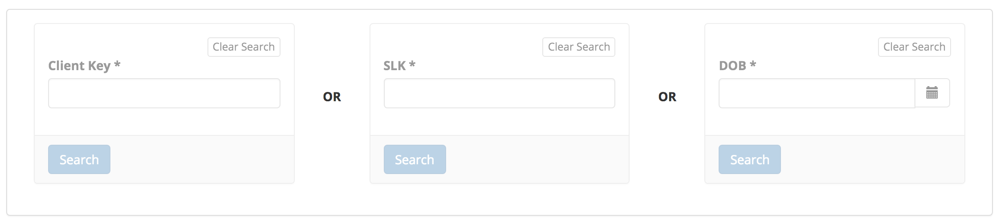

.. _data-entry-user-docs:

Data entry
==========

The AMHC Support Service Minimum Data Set is an extension of the
Primary Mental Health Care Minimum Data Set (PMHC MDS); current PMHC MDS Data
online User Guide for Data Entry is available to be viewed at
https://docs.pmhc-mds.com/user-documentation/data-entry.html.

PMHC client data
^^^^^^^^^^^^^^^^

For more detail on how to search, find, view, add, edit or delete Client PMHC data in the PMHC MDS,
please visit the PMHC User Guide at https://docs.pmhc-mds.com/projects/user-documentation/en/latest/data-entry.html#client-data.

PMHC episodes
^^^^^^^^^^^^^

For more detail on how to find, view, add, edit or delete Client PMHC Episode
data in the PMHC MDS, please visit the PMHC User Guide at
https://docs.pmhc-mds.com/projects/user-documentation/en/latest/data-entry.html#episodes.

.. _amhc-episode-data:

AMHC episodes
^^^^^^^^^^^^^

You can view a client’s episodes through Viewing a Client’s details available
on the Data Entry tab, by following these steps:

.. _view-episodes:

Viewing a client's PMHC episode
-------------------------------

You can view a client's AMHC episodes through viewing a client's details
available on the Data Entry tab, by following these steps:

1. Search for the client using one of the three search fields.

2. Click on the Client Key in blue displayed within the table list.

.. figure:: screen-shots/client-search-results.png
   :alt: Client Search View

3. From the Client's Summary tab, you can shortcut straight to an episode by clicking
   the Blue Episode Key displayed in the snapshot of the five most recent episodes.

4. Alternately, if you would like to view all episodes you can click on the
   Episode Tab. The heading for this tab displays in brackets the total number of episodes recorded
   in the PMHC MDS for this client at Provider Organisations for which you have access.

A table will display all the Client's Episodes at Provider Organisations for which you have access.

A Drop down list is available to view:

* All Episodes
* Currently Open Episodes
* Closed Episodes

To view the Client's Episode details, click the Blue Episode Key.

A page will display the Client's PMHC Episode details.

.. _add-amhc-episode:

Adding a client's AMHC episode data
-----------------------------------

You can edit a Client's PMHC Episode details through :ref:`view-episodes`
available on the Data Entry tab to add a Client's AMHC Episode data, by following these steps:

1. Once :ref:`view-episodes`.
2. From the Client's Episode table, click the Episode Key.
3. Click Edit Details tab.
4. Click on the 'Australian Government AMHC hubs (!covid19)' checkbox or
   type ``!covid19`` in the 'Tags' fields and press tab

.. figure:: screen-shots/client-episodes-h2h-tag.png
   :alt: Client Episodes AMHC Tag

5. Scroll to the bottom of the PMHC Episode
Add the Client's AMHC Episode details. Mandatory fields are marked with
an * . (Specification :ref:`AMHC Episode Data Elements <amhc-episode-data-elements>`)

6. Click the blue 'Save' button. (If you decide not to add AMHC data, you can simply navigate away from this screen)

You will receive confirmation that the Client's Episode details have been saved,
and it will now be displaying.

        .. figure:: screen-shots/saved.png
           :alt: Client Episode Data Saved Successfully

If you receive an error message, the data will need to be corrected before the
record is saved and added to the PMHC MDS.
See Validation Rules - :ref:`AMHC Episode <amhc-episode-current-validations>`

.. _edit-amhc-episode:

Editing a client's AMHC episode data
------------------------------------------

You can edit a Client's PMHC Episode details through :ref:`view-episodes`
available on the Data Entry tab, by following these steps:

1. Once :ref:`view-episodes`.
2. From the Client's Episode table, click the Episode Key.
3. Click Edit Details tab.
4. Scroll to the bottom of the PMHC Episode.

Update the Client's AMHC Episode details. Mandatory fields are marked
with an * . (Specification :ref:`AMHC Episode Data Elements <amhc-episode-data-elements>`)

.. figure:: screen-shots/client-episodes-h2h-edit.png
   :alt: Client Episodes Edit Details

5. Click the blue 'Save' button. (If you decide not to save changes, you can simply navigate away from this screen)

You will receive confirmation that the Client's AMHC Episode details have been saved,
and it will now be displaying these new details in the Episode View Details tab.

        .. figure:: screen-shots/saved.png
           :alt: Client Episode Data Saved Successfully

If you receive an error message, the data will need to be corrected before the
record is saved and added to the PMHC MDS.
See Validation Rules - :ref:`AMHC Episode <amhc-episode-current-validations>`

.. _delete-amhc-episode:

Deleting a AMHC episode
-----------------------

Removing the ``!amhc`` tag will delete a AMHC Episode, through :ref:`view-episodes`
available on the Data Entry tab, by following these steps:

1. Once :ref:`view-episodes`.
2. From the Client's Episode table, click the Episode Key.
3. Click Edit Details tab.
4. Uncheck the 'Australian Government AMHC hubs (!amhc)' checkbox or
   click on the cross on the ``!amhc`` tag to remove it.

5. Click the blue 'Save' button.

   Any associated measures will be retained.

        .. figure:: screen-shots/client-episodes-amhc-delete.png
           :alt: Client Episodes AMHC Delete Details

   **Please note: Once the episode data is deleted, you will not be able to
   recover this episode data.**

6. Click the red 'Confirm' button to delete the data. (If you decide not to
   delete the data, you can click the blue 'Cancel' button)

        .. figure:: screen-shots/saved.png
           :alt: Client Episode Data Saved Successfully

.. _collection-occasion-data:

Collection Occasions
^^^^^^^^^^^^^^^^^^^^

For more detail on how to find, view, add, edit or delete Client PMHC
Collection Occasion data in the PMHC MDS, please visit the PMHC User Guide at
https://docs.pmhc-mds.com/projects/user-documentation/en/latest/data-entry.html#outcome-collection-occasions.

.. _collection-occasion-measure-data:

Collection Occasion Measures
^^^^^^^^^^^^^^^^^^^^^^^^^^^^

For more detail on how to find, view, add, edit or delete Client PMHC Collection
Occasion Measures data in the PMHC MDS, please visit the PMHC User Guide at
https://docs.pmhc-mds.com/projects/user-documentation/en/latest/data-entry.html#collection-occasion-measures.

PMHC Service Contact Data
^^^^^^^^^^^^^^^^^^^^^^^^^

For more detail on how to search, find, view, add, edit or delete Service
Contact PMHC data in the PMHC MDS, please visit the PMHC User Guide at
https://docs.pmhc-mds.com/projects/user-documentation/en/latest/data-entry.html#service-contacts.

AMHC Service Contact Data
^^^^^^^^^^^^^^^^^^^^^^^^^

AMHC adds two extra fields to the standard PMHC Service Contact:

* AMHC Service Contact - Practitioner Category and
* AMHC Service Contact - Start Time to the standard PMHC Service Contact.

Update the Client's Service Contact details. Mandatory fields are marked
  with an * . (Specification :ref:`Service Contact Data Elements <service-contact-data-elements>`
  and :ref:`AMHC Service Contact Data Elements <amhc-service-contact-data-elements>`)

    .. figure:: screen-shots/client-amhc-service-contact.png
       :alt: Client AMHC Service Contact
